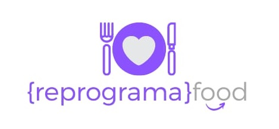

# <div align = "center"> ON15-TET-S10-Revisão </div>

<div align = "center">
    <p>
        Turma Online Todas em Tech - Back-end | Semana 10: Projeto Guiado: revisão <b>CRUD</b>.
    </p>
</div>

<br>
<div align = "center">

</div>
<br>

# Sumário 
- [Introdução](#introdução)
    - [HTTP](#http)
    - [CRUD](#crud)
    - [RELAÇÃO ENTRE OS VERBOS HTTP E O CRUD](#relação-entre-os-verbos-http-e-o-crud)
    - [WEB API](#web-api)
- [Todas em Tech](#todas-em-tech)
    - [SEMANA 10](#semana-10)
- [{reprograma}food](#reprogramafood)
    - [PROJETO](#projeto)
    - [OBJETIVO](#objetivo)
    - [ARQUITETURA](#arquitetura)
    - [DESENVOLVIMENTO](#desenvolvimento)
        - [ROTAS](#rotas)
            - [Método GET](#método-get)
            - [Método PATCH](#método-patch)
            - [Método PUT](#método-put)
            - [Método DELETE](#método-delete)
            - [Método POST](#método-post)
        - [FUNCIONAMENTO](#funcionamento)
    - [INFORMAÇÕES TÉCNICAS](#informações-técnicas)
        - [DEPENDÊNCIAS](#dependências)
            - [Módulos](#módulos)
            - [Arquivos](#arquivos)
        - [INSTALAÇÃO](#instalação)
- [Referências](#referências)


#  Introdução 

##  HTTP: 

<div align = "justify">
 HTTP é um protocolo responsável pela comunicação de websites. Um website, ao ser acessado, recebe esse protocolo. Esse protocolo possui métodos, que também podem ser chamados de verbos. O protocolo baseado no modelo Client/Server, possui pedidos (requests) e respostas (responses) e é através desses requests e responses que a comunicação acontece. Os métodos HTTP, que definem qual ação acontecerá, são: GET, POST, PUT, PATCH e DELETE.
</div>

<div align = "center">

|           GET         |           POST          |          DELETE        |           PUT           |          PATCH         | 
| :-------------------: | :-------------------:   | :-------------------:  | :---------------------: |:---------------------: |
|          Ler          |          Criar          |          Deletar       |          Atualizar      |         Atualizar      |
| leitura de dados      |    cria um dado         |    deleta um dado     |  atualiza completamente |   atualiza em partes   |

</div>

##  CRUD:


<div align = "justify">

CRUD são as quatro operações básicas utilizadas em bases de dados relacionais fornecidas aos utilizadores do sistema: CREATE, READ, UPDATE e DELETE. Utilizando o método CRUD, é possível criar, fazer leitura, atualizar e deletar itens. 
    
</div>

## RELAÇÃO ENTRE OS VERBOS HTTP E O CRUD:

<div align = "justify">
    
O acrônimo CRUD tem relação direta com os verbos (métodos) GET, PUT, POST, PATCH, DELETE, como é possível visualizar na tabela abaixo: 
    
</div>

<div align = "center">

|          CRUD       |           VERBOS          |       
| :-------------------: | :---------------------: |
|          CREATE      |          POST      |         
|    READ     |  GET |   
|    UPDATE    |  PUT/PATCH| 
|    DELETE    |  DELETE | 

</div>

## WEB API:

<div align = "justify">
 Uma web API (Application Programming Interfaces) é uma construção disponível nas linguagens de programação, que possibilita a criação de funcionalidades complexas, de modo mais simplificado, por desenvolvedores. A contrução abstrai o código mais complexo, proporcionando o uso de sintaxes mais simples em seu lugar.
    
</div>

<br>

# Todas em Tech 

<div align = "justify">
    
Todas em Tech é um projeto da [{reprograma}](https://reprograma.com.br/), que tem como objetivo ensinar programação, possibilitando oportunidades de um futuro melhor, através da tecnologia, para mulheres em situações de vulnerabilidade social, econômica e de gênero, com foco em mulheres negras, trans e/ou travestis.
</div>
<br>  

##  SEMANA 10: 

<div align = "justify">
    
Durante a semana 10 do curso {reprograma}, as alunas tiveram uma revisão sobre o protocolo HTTP e seus métodos, criação de WEB API seguindo arquitetura MVC e como realizar o **CRUD**. Como projeto da semana, as alunas deveriam criar uma API sobre estabelecimentos, estando livres para escolher o tipo de comércio que gostariam de utilizar.  

<br> 
<br> 

</div>

<div align = "center">

# {reprograma}food 

</div>

## PROJETO 

<div align = "justify">

Para esse projeto foi criada uma Web API com o tema: [restaurantes](https://github.com/BrunaCelestino/ON15-TET-S10-Revisao-API/blob/BrunaCelestino/para_o_lar/reprograma-food/src/models/restaurantesModels.json) encontrados na plataforma Ifood. Todos os restaurantes contidos nesse projeto, bem como suas respectivas informações, são reais e estão localizados na cidade de Jacareí - SP.   

<br>

</div>

### OBJETIVO: 
<div align = "justify">

O objetivo dessa web API é reunir os restaurantes cadastrados na plataforma Ifood, localizados na cidade de Jacareí -SP, tornando possível para os usuários pesquisar informações sobre os restaurantes, baseando-se em uma série de parâmetros, utilizando o método **GET**, além de possibilitar o cadastro de novos restaurantes, utilizando o método **POST**, remover restaurantes com o método **DELETE**, atualizar restaurantes por completo usando **PUT**, atualizar apenas o nome do restaurante, telefone ou qualquer outro item desejado, além de avaliar o restaurante, obtendo uma nova média de avaliação, utilizando **PATCH**. 

<br>
</div>

###  ARQUITETURA: 

<div align = "justify">

Esse projeto foi construído utilizando a arquitetura MVC, acrônimo para Model-View-Controller ou, em português, Arquitetura Modelo-Visão-Controle. MVC é um padrão de arquitetura de software, voltado para o reuso de códigos e onde a separação dos mesmos ocorre em três camadas interconectadas. A apresentação dos dados é separada dos métodos que interagem com o banco de dados.

</div>

O servidor, criado dentro da pasta [reprograma-food](https://github.com/BrunaCelestino/ON15-TET-S10-Revisao-API/tree/BrunaCelestino/para_o_lar/reprograma-food), conta com a seguinte estrutura:


```bash
        \--📂 reprograma-food
            | 
            |    server.js
            |
            |    package-lock.json
            |    package.json
            |    README.md
            |
            |--📂assets
            \--📂src
                    |
                    |   app.js
                    |
                    📂---controllers
                    |
                    |   restaurantesController.js
                    |
                    |
                    📂---models
                    |
                    |   restaurantesModels.json
                    |   
                    |
                    📂---routes
                        restaurantesRoutes.js  			      

 ```

<div align = "justify">

- [server.js](https://github.com/BrunaCelestino/ON15-TET-S10-Revisao-API/blob/BrunaCelestino/para_o_lar/reprograma-food/server.js) - Define onde o servidor local irá ser executado;

- [app.js](https://github.com/BrunaCelestino/ON15-TET-S10-Revisao-API/blob/BrunaCelestino/para_o_lar/reprograma-food/src/app.js) - Requere as dependências necessárias para o projeto e define o padrão de cada rota;

- [controllers](https://github.com/BrunaCelestino/ON15-TET-S10-Revisao-API/tree/BrunaCelestino/para_o_lar/reprograma-food/src/controllers) - pasta contendo o arquivo: [restaurantesController.js](https://github.com/BrunaCelestino/ON15-TET-S10-Revisao-API/blob/BrunaCelestino/paraOLar/reprograma-food/src/controllers/restaurantesController.js), que define, em fuções, o que cada rota deve realizar;
     
- [models](https://github.com/BrunaCelestino/ON15-TET-S10-Revisao-API/tree/BrunaCelestino/para_o_lar/reprograma-food/src/models)- pasta contendo o aquivo [restaurantesModels.json](https://github.com/BrunaCelestino/ON15-TET-S10-Revisao-API/blob/BrunaCelestino/paraOLar/reprograma-food/src/models/restaurantesModels.json), que contém as informações sobre os restaurantes; 

- [routes](https://github.com/BrunaCelestino/ON15-TET-S10-Revisao-API/tree/BrunaCelestino/para_o_lar/reprograma-food/src/routes) - pasta contendo o arquivo: [restaurantesRoutes.js](https://github.com/BrunaCelestino/ON15-TET-S10-Revisao-API/blob/BrunaCelestino/paraOLar/reprograma-food/src/routes/restaurantesRoutes.js). Esse arquivo acrescenta o complemento à rota genérica, fazendo com que ela se torne completa e possa ser acessada; 

- Outros arquivos e pastas - pasta [assets](https://github.com/BrunaCelestino/ON15-TET-S10-Revisao-API/tree/BrunaCelestino/para_o_lar/reprograma-food/assets), que contém o logo do projeto, package-lock.json e package.json. que são arquivos relacionados a dependências e README.md, contendo a documentação do projeto.

</div>

<br>

## DESENVOLVIMENTO 
<div align = "justify">

Através de uma busca realizada na plataforma Ifood, foram selecionados 10 restaurantes, para serem inseridos na API **{reprograma}food**. Cada restaurante foi preenchido com informações como nome, avaliação por estrelas, descrição sobre o estabelecimento, endereço, telefone, quais as especialidades do restaurante, bem como o tipo de serviço que o mesmo oferece: delivery, presencial ou retirada.   
Além disso, o cadastro conta com o horário de funcionamento, o tempo de entrega máximo, os meios de pagamento aceitos, taxa de entrega, perfil no Ifood e um cardápio contendo o nome dos pratos, os ingredientes contidos neles e o preço de cada um. Cada restaurante é ordenado por um **id** numérico único.  
  

<div align = "center"> Exemplo de um restaurante cadastrado:  


</div>

```json
[
    {
        "id": 1,
        "nome": "Mineiro Delivery - Jacareí",
        "estrelas": 4.7
        ,
        "sobre": "Deliciosa comida caseira com tempero mineiro, tudo juntim em um box prático e que mantém a comida quentinha e saborosa. Nosso cardápio inclui desde o tradicional arroz com feijão acompanhados de carne suína, carne bovina, frango, peixe, camarão, até pratos como strogonoff, macarrão, porções, saudáveis, doces mineiros e bebidas geladas. Longe de ser apenas uma marmita, somos a melhor comida brasileira no box! Baião de dois, Carreteiro, Caipira, Feijoada, Churrasco, Promoções e muito mais!!!",
        "endereco": {
            "rua": "Amin Esper",
            "numero": "195",
            "bairro": "Jardim Pereira do Amparo",
            "cidade": "Jacareí",
            "estado": "São Paulo",
            "CEP": "12327-699"
        },
        "telefone": "(12)3959-2298",
        "especialidade": [
            "caseira",
            "mineira"
        ],
        "tipoDeServico": [
            "delivery"
        ],
        "horarioDeFuncionamento": {
            "abertura": 9.30,
            "fechamento": 22.45
        },
        "tempoDeEntrega": 40,
        "pagamento": [
            "dinheiro",
            "pix",
            "debito",
            "credito",
            "vale-refeicao"
        ],
        "cardapio": [
            {
                "prato": "feijoada",
                "Ingredientes": [
                    "feijão carioca preto",
                    "pedaços de pele suína",
                    "cubos de carne seca",
                    "paio",
                    "pernil suíno",
                    "bacon frito",
                    "tiras de couve",
                    "arroz",
                    "farofa"
                ],
                "preco": 24.99
            },
            {
                "prato": "carne de panela",
                "Ingredientes": [
                    "carne bovina cozida em cubos",
                    "cubos de batata cozida",
                    "cheiro verde",
                    "arroz"
                ],
                "preco": 28.99
            },
            {
                "prato": "fraldinha",
                "Ingredientes": [
                    "fraldinha selada",
                    "cebola em tiras",
                    "brócolis",
                    "arroz"
                ],
                "preco": 28.99
            },
            {
                "prato": "strogonoff de carne",
                "Ingredientes": [
                    "cortes de coxão mole flambados",
                    "molho vermelho",
                    "creme de leite",
                    "champignon",
                    "arroz",
                    "batata palha"
                ],
                "preco": 25.99
            },
            {
                "prato": "galinhada",
                "Ingredientes": [
                    "frango ao molho caipira",
                    "milho verde",
                    "cebola em cubinhos",
                    "cheiro verde",
                    "arroz"
                ],
                "preco": 23.99
            }
        ],
        "taxaDeEntrega": 5,
        "Ifood": "https://www.ifood.com.br/delivery/jacarei-sp/mineiro-delivery---jacarei-jardim-pereira-do-amparo/669c20d6-f666-444d-be61-7b707dba184f"
    },
]
```
</div>

<div align = "justify">

Após o término da fase de pesquisa e indexação dos restaurantes, foram desenvolvidas as lógicas necessárias para o funcionamento dos métodos, contidas dentro de funções. A cada função, um tratamento de erro foi criado por método **try-catch**, e os devidos status aplicados. Dentre os casos positivos, temos o status ***200*** indicando sucesso e ***201***, indicando que um item foi criado. Dentre os erros, podemos destacar o ***404***, onde um item não pode ser encontrado, ***406***, onde o request não é aceitado, ***409***, indicando conflito e ***500***, indicando erro interno do servidor.  
Com as lógicas contruídas, a próxima etapa foi a criação das seguintes rotas:

</div>

###  ROTAS: 

####  Método GET: 

<div align = "center">

|  Método  |                  Rota                       |                                Descrição                     |
| :------: | :-------------------------------------:     | :-------------------------------------------------------:    |
|  `GET`   | localhost:8099/restaurantes/lista           |                            Lista de todos os restaurantes    |
|  `GET`   | localhost:8099/restaurantes/lista/:id       |                                      Busca por ID            |
|  `GET`   | localhost:8099/restaurantes/nameSearch?name=|                                       Busca por nome         |
|  `GET`   | localhost:8099/restaurantes/stars           |                         Busca e lista organizada por estrela |
|  `GET`   | localhost:8099/restaurantes/description     |              Lista nome e descrição, busca por descrição/nome|
|  `GET`   | localhost:8099/restaurantes/phone           |                        Lista nome e telefone, busca por nome |
|  `GET`   | localhost:8099/restaurantes/adress          |                        Lista nome e endereço, busca por nome |
|  `GET`   | localhost:8099/restaurantes/specialty       |         Lista nome e especialidade, busca especialidade/nome |
|  `GET`   | localhost:8099/restaurantes/hours           |     Lista nome e horário de funcionamento, busca por horário |
|  `GET`   | localhost:8099/restaurantes/deliveryTime    |                Busca e lista organizada por tempo de entrega |
|  `GET`   | localhost:8099/restaurantes/payment         |   Lista nome e opções de pagamento, busca por pagamento/nome |
|  `GET`   | localhost:8099/restaurantes/menu            |     Lista nome e cardápio, busca por prato/ingredientes/nome |
|  `GET`   | localhost:8099/restaurantes/priceAverage    |            Lista nome e média de preço, busca por média/nome |
|  `GET`   | localhost:8099/restaurantes/deliveryFee     |                 Busca e lista organizada por taxa de entrega |
|  `GET`   | localhost:8099/restaurantes/ifood           |                   Lista nome e perfil Ifood, busca por nome  |

<br>
</div>

####  Método PATCH: 

<div align = "center">

|  Método  |                  Rota                       |                                Descrição                     |
| :------: | :-------------------------------------:     | :-------------------------------------------------------:    |
| `PATCH`  |  localhost:8099/restaurantes/updateName/:id |          Atualizar nome do restaurante por ID                |
| `PATCH`  | localhost:8099/restaurantes/updatePhone/:id |          Atualizar telefone do restaurante por ID            |
| `PATCH`  | localhost:8099/restaurantes/updateItems/:id |    Atualizar qualquer item do restaurante por ID             |
| `PATCH`  |  localhost:8099/restaurantes/giveStars/:id  |          Avaliar restaurante por ID                          |

<br>
</div>

####  Método PUT: 

<div align = "center">

|  Método  |                  Rota                       |                                Descrição                     |
| :------: | :-------------------------------------:     | :-------------------------------------------------------:    |
|   `PUT`  |  localhost:8099/restaurantes/update/:id     |    Atualizar completamente restaurante por ID                |

<br>
</div>


####  Método DELETE: 

<div align = "center">

|  Método  |                  Rota                       |                                Descrição                     |
| :------: | :-------------------------------------:     | :-------------------------------------------------------:    |
| `DELETE` |  localhost:8099/restaurantes/delete/:id     |                   Deletar restaurante por ID                 |

<br>
</div>


####  Método POST:

<div align = "center">

|  Método  |                  Rota                       |                                Descrição                     |
| :------: | :-------------------------------------:     | :-------------------------------------------------------:    |
|  `POST`  |     localhost:8099/restaurantes/new         |                    Cadastrar novo restaurante                |

<br>
</div>

###  FUNCIONAMENTO: 

<div align = "justify">

1. `GET`: localhost:8099/restaurantes/lista  
Com essa rota, é possível se ter acesso a todos os restaurantes cadastrados. Para refinar a busca, os seguintes Query Params foram criados: 
</div>

<div align = "center">

|Query Params|Função|
|:---  |:--- |
|`name`|filtrar restaurantes por nome|
|`stars`|filtrar restaurantes por estrelas iguais ou maiores|
|`specialty`|filtrar restaurantes por especialidade|
|`serviceType`|filtrar restaurantes por tipo de serviço|
|`deliveryTime`|filtrar restaurantes por tempo de entrega|
|`paymentOptions`|filtrar restaurantes por opções de pagamento|
|`deliverFee`|filtrar restaurantes por taxa de entrega igual ou menor|
|`description`|filtrar restaurantes por descrição|
</div>
<br>
<div align = "justify">
As Query Params podem ser combinadas para refinar ainda mais as buscas. 
</div>
<br>

<div align = "justify">

2. `GET`: localhost:8099/restaurantes/lista/:id  
Com essa rota, é possível se ter acesso a um restaurante, buscando-o pelo **id** inserido na própria rota. 
<br>

3. `GET`: localhost:8099/restaurantes/nameSearch?name=  
Com essa rota, é possível se ter acesso a restaurantes, buscando-os pelo nome. 
</div>

<div align = "center">

|Query Params|Função|
|:---  |:--- |
|`name`|buscar restaurantes por nome|
</div>

<div align = "justify">

4. `GET`: localhost:8099/restaurantes/stars  
Com essa rota, é possível se ter acesso a lista de restaurantes organizados por estrelas, das mais altas até as mais baixas. Usando os seguintes Query Params, é possível refinar a busca:

</div>
<div align = "center">

|Query Params|Função|
|:---  |:--- |
|`name`|filtrar restaurantes por nome|
|`stars`|filtrar restaurantes por estrelas iguais ou maiores|

</div>

```json
{
    "Busca por:": {},
    "Restaurantes encontrados": 10,
    "Restaurantes ordenados por estrela": [
        {
            "Nome": "Açai 100 Miséria - Loja 2",
            "Estrelas": "5.0"
        },
        {
            "Nome": "Sorveteria Crenata",
            "Estrelas": "4.8"
        },

```

<div align = "justify">

5. `GET`: localhost:8099/restaurantes/description  
Com essa rota, é possível se ter acesso a lista de restaurantes com seus nomes e descrições. Usando os seguintes Query Params, é possível refinar a busca:

</div>

<div align = "center">

|Query Params|Função|
|:---  |:--- |
|`name`|filtrar restaurantes por nome|
|`description`|filtrar restaurantes por descrição|

</div>

```json
{
    {
    "Busca por:": {},
    "Restaurantes encontrados": 10,
    "Lista de restaurantes": [
        {
            "nome": "Mineiro Delivery - Jacareí",
            "sobre": "Deliciosa comida caseira com tempero mineiro, tudo juntim em um box prático e que mantém a comida quentinha e saborosa. Nosso cardápio inclui desde o tradicional arroz com feijão acompanhados de carne suína, carne bovina, frango, peixe, camarão, até pratos como strogonoff, macarrão, porções, saudáveis, doces mineiros e bebidas geladas. Longe de ser apenas uma marmita, somos a melhor comida brasileira no box! Baião de dois, Carreteiro, Caipira, Feijoada, Churrasco, Promoções e muito mais!!!"
        },

```

<div align = "justify">

6. `GET`: localhost:8099/restaurantes/phone  
Com essa rota, é possível se ter acesso a lista de restaurantes com seus nomes e telefones. Usando os seguintes Query Params, é possível refinar a busca:

</div>

<div align = "center">

|Query Params|Função|
|:---  |:--- |
|`name`|filtrar restaurantes por nome|

</div>

<div align = "justify">

```json
{
    "Busca por:": {},
    "Restaurantes encontrados": 10,
    "Lista de restaurantes": [
        {
            "Nome": "Mineiro Delivery - Jacareí",
            "Telefone": "(12)3959-2298"
        },
        {
            "Nome": "Vip Sushi 1 Peça = R$1 - Jacarei",
            "Telefone": "(11)97449-3634"
        },

```

</div>

7. `GET`: localhost:8099/restaurantes/adress      
Com essa rota, é possível se ter acesso a lista de restaurantes com seus nomes e endereços. Usando os seguintes Query Params, é possível refinar a busca:

</div>

<div align = "center">

|Query Params|Função|
|:---  |:--- |
|`name`|filtrar restaurantes por nome|


</div>

<div align = "justify">

```json
{
    "Busca por:": {},
    "Restaurantes encontrados": 10,
    "Lista de restaurantes": [
        {
            "Nome": "Mineiro Delivery - Jacareí",
            "Endereço": {
                "rua": "Amin Esper",
                "numero": "195",
                "bairro": "Jardim Pereira do Amparo",
                "cidade": "Jacareí",
                "estado": "São Paulo",
                "CEP": "12327-699"
            }
        },

```

</div>

<div align = "justify">

8. `GET`: localhost:8099/restaurantes/specialty    
Com essa rota, é possível se ter acesso a lista de restaurantes com seus nomes e especialidades. Usando os seguintes Query Params, é possível refinar a busca:

</div>

<div align = "center">

|Query Params|Função|
|:---  |:--- |
|`name`|filtrar restaurantes por nome|
|`specialty`|filtrar restaurantes por especialidade|

</div>

<div align = "justify">

```json
{
    "Busca por:": {},
    "Restaurantes encontrados": 10,
    "Lista de restaurantes": [
        {
            "Nome": "Mineiro Delivery - Jacareí",
            "Especialidades": [
                "caseira",
                "mineira"
            ]
        },

```

</div>

<div align = "justify">

9. `GET`: localhost:8099/restaurantes/serviceType      
Com essa rota, é possível se ter acesso a lista de restaurantes com seus nomes e tipos de serviço. Usando os seguintes Query Params, é possível refinar a busca:

</div>

<div align = "center">

|Query Params|Função|
|:---  |:--- |
|`name`|filtrar restaurantes por nome|
|`serviceType`|filtrar restaurantes por tipo de serviço|


</div>

<div align = "justify">

```json
{
    "Busca por:": {},
    "Restaurantes encontrados": 10,
    "Lista de restaurantes": [
        {
            "Nome": "Mineiro Delivery - Jacareí",
            "Tipos de serviço": [
                "delivery"
            ]
        },

```

</div>

<div align = "justify">

10. `GET`: localhost:8099/restaurantes/hours        
Com essa rota, é possível se ter acesso a lista de restaurantes com seus nomes e horário de funcionamento. Usando os seguintes Query Params, é possível refinar a busca:

</div>

<div align = "center">

|Query Params|Função|
|:---  |:--- |
|`name`|filtrar restaurantes por nome|
|`openingHours`|filtrar restaurantes por horário de abertura menor ou igual|
|`closingHours`|filtrar restaurantes por horário de fechamento menor ou igual|

</div>

<div align = "justify">

```json
{
    "Busca por:": {},
    "Restaurantes encontrados": 10,
    "Lista de restaurantes": [
        {
            "Nome": "Mineiro Delivery - Jacareí",
            "Horário de funcionamento": {
                "abertura": "9:30",
                "fechamento": "22:45"
            }

```

</div>

<div align = "justify">

11. `GET`: localhost:8099/restaurantes/deliveryTime          
Com essa rota, é possível se ter acesso a lista de restaurantes com seus nomes e tempo de entrega, da menor para maior. Usando os seguintes Query Params, é possível refinar a busca:

</div>

<div align = "center">

|Query Params|Função|
|:---  |:--- |
|`name`|filtrar restaurantes por nome|
|`deliveryTime`|filtrar restaurantes por tempo de entrega menor ou igual|

</div>

<div align = "justify">

```json
{
    "Busca por:": {},
    "Restaurantes encontrados": 10,
    "Lista de restaurantes": [
        {
            "Nome": "Padaria União de Jacareí",
            "Tempo de entrega": "32 minutos"
        },
        {
            "Nome": "Mineiro Delivery - Jacareí",
            "Tempo de entrega": "40 minutos"
        },
```

</div>

<div align = "justify">

12. `GET`: localhost:8099/restaurantes/payment         
Com essa rota, é possível se ter acesso a lista de restaurantes com seus nomes e opções de pagamento. Usando os seguintes Query Params, é possível refinar a busca:

</div>

<div align = "center">

|Query Params|Função|
|:---  |:--- |
|`name`|filtrar restaurantes por nome|
|`paymentOptions`|filtrar restaurantes por opções de pagamento|

</div>

<div align = "justify">

```json
{
    "Busca por:": {},
    "Restaurantes encontrados": 10,
    "Lista de restaurantes": [
        {
            "Nome": "Mineiro Delivery - Jacareí",
            "Opções de pagamento": [
                "dinheiro",
                "pix",
                "debito",
                "credito",
                "vale-refeicao"
            ]
        },
```

</div>

<div align = "justify">

13. `GET`: localhost:8099/restaurantes/menu         
Com essa rota, é possível se ter acesso a lista de restaurantes com seus nomes e cardápio. Usando os seguintes Query Params, é possível refinar a busca:

</div>

<div align = "center">

|Query Params|Função|
|:---  |:--- |
|`name`|filtrar restaurantes por nome|
|`dish`|filtrar restaurantes por pratos|
|`ingredients`|filtrar restaurantes por ingredientes|

</div>

<div align = "justify">

```json
{
    "Busca por:": {},
    "Lista de restaurantes": [
        {
            "Nome": "Mineiro Delivery - Jacareí",
            "cardápio": [
                {
                    "prato": "feijoada",
                    "Ingredientes": [
                        "feijão carioca preto",
                        "pedaços de pele suína",
                        "cubos de carne seca",
                        "paio",
                        "pernil suíno",
                        "bacon frito",
                        "tiras de couve",
                        "arroz",
                        "farofa"
                    ],
                    "preco": 24.99
                },
```

</div>

<div align = "justify">

14. `GET`: localhost:8099/restaurantes/priceAverage          
Com essa rota, é possível se ter acesso a lista de restaurantes com seus nomes e a média de preço de seus pratos, da menor para a maior. Usando os seguintes Query Params, é possível refinar a busca:

</div>

<div align = "center">

|Query Params|Função|
|:---  |:--- |
|`name`|filtrar restaurantes por nome|
|`price`|filtrar restaurantes por média de preço igual ou menor|


</div>

<div align = "justify">

```json
{
    "Busca por:": {},
    "Restaurantes Encontrados": 10,
    "Lista de restaurantes": [
        {
            "restaurante": "Padaria União de Jacareí",
            "media": "R$ 11,62"
        },
        {
            "restaurante": "Sorveteria Crenata",
            "media": "R$ 11,80"
        },
```

</div>

<div align = "justify">

15. `GET`: localhost:8099/restaurantes/deliveryFee            
Com essa rota, é possível se ter acesso a lista de restaurantes com seus nomes e a taxa de entrega, da menor para maior. Usando os seguintes Query Params, é possível refinar a busca:

</div>

<div align = "center">

|Query Params|Função|
|:---  |:--- |
|`name`|filtrar restaurantes por nome|
|`deliverFee`|filtrar restaurantes por taxa de entrega igual ou menor|


</div>

<div align = "justify">

```json
{
    "Busca por:": {},
    "Restaurantes encontrados": 10,
    "Lista de restaurantes": [
        {
            "Nome": "Vip Sushi 1 Peça = R$1 - Jacarei",
            "Taxa de entrega": "R$ 0,00"
        },
        {
            "Nome": "Pizzaria Bianka´s",
            "Taxa de entrega": "R$ 0,00"
        },

```

</div>

<div align = "justify">

16. `GET`: localhost:8099/restaurantes/ifood              
Com essa rota, é possível se ter acesso a lista de restaurantes com seus nomes e os links para os perfis dos restaurantes no Ifood. Usando os seguintes Query Params, é possível refinar a busca:

</div>

<div align = "center">

|Query Params|Função|
|:---  |:--- |
|`name`|filtrar restaurantes por nome|


</div>

<div align = "justify">

```json
{
    "Busca por:": {},
    "Restaurantes encontrados": 10,
    "Lista de restaurantes": [
        {
            "Nome": "Mineiro Delivery - Jacareí",
            "Restaurante Ifood": "https://www.ifood.com.br/delivery/jacarei-sp/mineiro-delivery---jacarei-jardim-pereira-do-amparo/669c20d6-f666-444d-be61-7b707dba184f"
        },
        
```

</div>

<div align = "justify">

17. `PATCH`: localhost:8099/restaurantes/updateName/:id               
Com essa rota, é possível atualizar o nome de um restaurante, buscando por **id** e enviando o um body request com a chave "nome":

</div>


<div align = "justify">

```json
{"nome": "Bolos da Bruna"}              
```

</div>

<div align = "justify">

18. `PATCH`: localhost:8099/restaurantes/updatePhone/:id               
Com essa rota, é possível atualizar o telefone de um restaurante, buscando por **id** e enviando o um body request com a chave "telefone":

</div>


<div align = "justify">

```json
{"telefone": "(12) 98892-4146"}             
```

</div>

<div align = "justify">

19. `PATCH`: localhost:8099/restaurantes/updateItems/:id               
Com essa rota, é possível atualizar qualquer item de um restaurante, buscando por **id** e enviando o um body request com a chave desejada:

</div>


<div align = "justify">

```json
{"taxaDeEntrega": 6}             
```

</div>

<div align = "justify">

20. `PATCH`: localhost:8099/restaurantes/giveStars/:id               
Com essa rota, é possível avaliar o restaurante, buscando por **id** e enviando o um body request com a quantidade de estrelas que se deseja avaliar. Uma nova média será calculada, utilizando a nota anterior do restaurante e a nova avaliação:

</div>


<div align = "justify">

```json
{"estrelas": 3}            
```

</div>

<div align = "justify">

21. `PUT`: localhost:8099/restaurantes/update/:id               
Com essa rota, é possível atualizar totalmente um restaurante, buscando por **id** e enviando o um body request com as novas informações. Não importa o id enviado no body, o id sempre será o mesmo do item que se deseja modificar:

</div>


<div align = "justify">

```json
{"id": 0,
    "nome": "Bolinhos da Bruna",
        "estrelas": 4.9,
        "sobre": "Bolos personalizados",
        "endereco": {
            "rua": "Avenida José Pereira de Andrade",
            "numero": "495",
            "bairro": "Jardim Santa Maria",
            "cidade": "Jacareí",
            "estado": "São Paulo",
            "CEP": "12328-290"
        },
        "telefone": "(12)98892-4146",
        "especialidade": [
            "bolo",
            "doce"
        ],
        "tipoDeServico": [
            "delivery"
        ],
        "horarioDeFuncionamento": {
            "abertura": 12.00,
            "fechamento": 23.30
        },
        "tempoDeEntrega": 100,
        "pagamento": [
            "pix"
        ],
        "cardapio": [
            {
                "prato": "kit cupcake - 10 unidades",
                "Ingredientes": [
                    "cupcake de chocolate",
                    "recheio de brigadeiro"
                ],
                "preco": 30.00
            },
            {
                "prato": "bolo personalizado",
                "Ingredientes": [
                    "bolo massa branca",
                    "pasta americana",
                    "recheio de prestigio"
                ],
                "preco": 120.00
            },
            {
                "prato": "kit doces sortidos - 50 unidades",
                "Ingredientes": [
                    "brigadeiro",
                    "beijinho",
                    "bicho de pé"
                ],
                "preco": 45.00
            },
            {
                "prato": "doce de festa grande - unidade",
                "Ingredientes": [
                    "brigadeiro",
                    "beijinho"
                ],
                "preco": 8.00
            },
            {
                "prato": "torta doce - tamanho grande",
                "Ingredientes": [
                    "torta doce holandesa"
                ],
                "preco": 70.00
            }
        ],
        "taxaDeEntrega": 9,
        "Ifood": "https://github.com/BrunaCelestino/ON15-TET-S10-Revisao-API/tree/main/para_o_lar"
}           
```

</div>

<div align = "justify">

22. `DELETE`: localhost:8099/restaurantes/delete/:id               
Com essa rota, é possível deletar um restaurante, buscando por **id**.

</div>

<div align = "justify">

23. `POST`: localhost:8099/restaurantes/new                 
Com essa rota, é possível criar um novo restaurante, através do body request, desde que todos os campos estejam preenchidos e que, caso o nome já exista na lista, que o telefone não seja igual ao restaurante com mesmo nome já existente.

</div>


<div align = "justify">

```json
{"nome": "Bolinhos da Bruna",
        "estrelas": 4.9,
        "sobre": "Bolos personalizados",
        "endereco": {
            "rua": "Avenida José Pereira de Andrade",
            "numero": "495",
            "bairro": "Jardim Santa Maria",
            "cidade": "Jacareí",
            "estado": "São Paulo",
            "CEP": "12328-290"
        },
        "telefone": "(12)98892-4146",
        "especialidade": [
            "bolo",
            "doce"
        ],
        "tipoDeServico": [
            "delivery"
        ],
        "horarioDeFuncionamento": {
            "abertura": 12.00,
            "fechamento": 23.30
        },
        "tempoDeEntrega": 100,
        "pagamento": [
            "pix"
        ],
        "cardapio": [
            {
                "prato": "kit cupcake - 10 unidades",
                "Ingredientes": [
                    "cupcake de chocolate",
                    "recheio de brigadeiro"
                ],
                "preco": 30.00
            },
            {
                "prato": "bolo personalizado",
                "Ingredientes": [
                    "bolo massa branca",
                    "pasta americana",
                    "recheio de prestigio"
                ],
                "preco": 120.00
            },
            {
                "prato": "kit doces sortidos - 50 unidades",
                "Ingredientes": [
                    "brigadeiro",
                    "beijinho",
                    "bicho de pé"
                ],
                "preco": 45.00
            },
            {
                "prato": "doce de festa grande - unidade",
                "Ingredientes": [
                    "brigadeiro",
                    "beijinho"
                ],
                "preco": 8.00
            },
            {
                "prato": "torta doce - tamanho grande",
                "Ingredientes": [
                    "torta doce holandesa"
                ],
                "preco": 70.00
            }
        ],
        "taxaDeEntrega": 9,
        "Ifood": "https://github.com/BrunaCelestino/ON15-TET-S10-Revisao-API/tree/main/para_o_lar"
}            
```

</div>

##  INFORMAÇÕES TÉCNICAS 
### DEPENDÊNCIAS:

<div align = "justify">

Para que fosse possível a execução desse projeto, foi necessária a utilização de algumas dependências, descritas a seguir:
</div>

<br>

###  Módulos:

<div align = "justify">

- [Express](https://www.npmjs.com/package/express) - framework para aplicativo da web do Node.js;
<br>

- [Nodemon](https://www.npmjs.com/package/nodemon) - ajuda no desenvolvimento de sistemas com o Node. js reiniciando automaticamente o servidor;
<br>

- [Cors](https://www.npmjs.com/package/cors) - permite que um site acesse recursos de outro site mesmo estando em domínios diferentes.
 <br>

</div>

###  Arquivos: 

<div align = "justify">

- [package-lock.json](https://github.com/BrunaCelestino/ON15-TET-S10-Revisao-API/blob/BrunaCelestino/para_o_lar/reprograma-food/package-lock.json) - especifica a versão e suas dependências;
<br>

- [package.json](https://github.com/BrunaCelestino/ON15-TET-S10-Revisao-API/blob/BrunaCelestino/para_o_lar/reprograma-food/package.json) - arquivo de configuração utilizado para estipular e configurar dependências;
<br>

- [.gitignore](https://github.com/BrunaCelestino/ON15-TET-S10-Revisao-API/blob/BrunaCelestino/.gitignore) - arquivo que lista quais arquivos ou pastas o Git deve ignorar.
<br>

</div>

<br>

###  INSTALAÇÃO: 

1. Entre na pasta onde você deseja clonar o repositório. Abra o **git** nela e digite: 

    ```bash
    $ git clone https://github.com/BrunaCelestino/ON15-TET-S10-Revisao-API
     ```

2. Digite a linha abaixo para entrar na pasta correta: 

    ```bash
    $ cd para_o_lar/
    ```

    ```bash
    $ cd reprograma-food/
    ```
    
3. Escreva a seguinte linha para instalar as dependências utilizadas nesse projeto: 

   ```bash
    $ npm install
    ```
4. Inicie o servidor, utilizando a frase: 

   ```bash
    $ npm start
    ```   

<br>

<div align = "justify">

- Importe a coleção para teste deste servidor clicando [aqui](https://www.getpostman.com/collections/4480f0f293117f655b69)!

- Copie o link acima e, no Postman, clique em **Import** -> **Link** (cole o link) -> **Continue** -> **Import**.

</div>

<br><br>

<div align = "center">

#  Referências 

</div>

<div align = "center">

|                           Título                          |            Link               |
| :-------------------------------------------------------: |    :------------------------: |
|                     API - GET & POST                      |   https://shre.ink/NIR        |
| HTTP: GET e POST - Conheça as diferenças entre os métodos |   https://shre.ink/NIZ        |
|        Diferença entre o método GET e POST em HTML        |   https://shre.ink/NI3        |
|      Dependências de produção vs. de desenvolvimento      |   https://shre.ink/NI9        |
|                       Package.json                        |   https://shre.ink/NIQ        |
|                          CRUD                             |   https://shre.ink/NI1        |
|                          MVC                              |   https://shre.ink/NIs        |
|                Métodos de requisição HTTP                 |   https://shre.ink/Ny0        |
|                          express                          |   https://shre.ink/Nyw        |
|                           cors                            |   https://shre.ink/NyQ        |
|                          nodemon                          |   https://shre.ink/NyX        |
|                   Introdução às Web APIs                  |   https://shre.ink/Nyv        |

</div>
